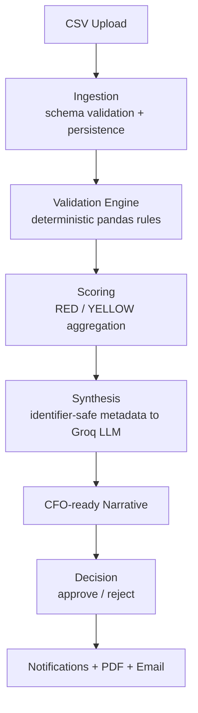

<div align="center">

# 💸 auxilab-agent-payment-run

### Agentic AI · Pre-payment batch validation & CFO-ready authorisation summaries

Part of [**AuxiLab**](https://auxiliobits.com/auxilab) — Auxiliobits' open-source agentic AI lab for Finance & AP operations.


</div>

---

## 📋 Table of Contents

- [What This Does](#-what-this-does)
- [Tools / Capabilities](#-tools--capabilities)
- [Architecture](#-architecture)
- [Tech Stack](#-tech-stack)
- [Project Structure](#-project-structure)
- [Installation](#-installation)
- [Environment Variables](#-environment-variables)
- [Usage](#-usage)
- [API Surface](#-api-surface)
- [CSV Schema](#-input--payment-batch-csv-schema)
- [Example](#-example)
- [Validation Rules](#-validation-rules)
- [Run with Docker](#-run-with-docker)
- [Running Tests](#-running-tests)
- [Known Limitations](#%EF%B8%8F-known-limitations)
- [Built By](#-built-by)
- [Licence](#-licence)

---

## 🎯 What This Does

`auxilab-agent-payment-run` is a **pre-disbursement control agent** for Accounts Payable teams. It ingests a payment batch (CSV), validates every line item against vendor master data, the invoice register, and historical payments using a **deterministic pandas rules engine**, then produces a **CFO-ready, identifier-safe risk-mitigation narrative** via an LLM.

The result is a single authorisation surface: AP managers upload and audit batches, the CFO reviews an aggregate risk summary, and disbursement is approved or rejected with a full decision and notification trail — **before money leaves the building.**

> [!IMPORTANT]
> **Validation is 100% deterministic.** The LLM **never** validates payments and **never** sees transaction-level identifiers (invoice numbers, payment IDs, vendor IDs, bank routing). It only converts already-computed aggregate metadata into an executive narrative — keeping audit results reproducible and preventing sensitive data leakage to the model.

---

## 🧰 Tools / Capabilities

| Name | Description |
| --- | --- |
| **Batch Ingestion** | Validates uploaded CSV schema (11 required columns), assigns a unique `batch_id`, and persists line items to SQLite. |
| **Validation Engine** | Deterministic pandas rules engine. Cross-checks each payment against `vendor_master`, `invoice_register`, and `payment_history`. |
| **Duplicate Detection** | Flags payments matching previously settled invoices (`DUPLICATE_PAYMENT`). |
| **Vendor & Routing Controls** | Detects `INVALID_VENDOR`, `INACTIVE_VENDOR`, and `BANK_ROUTING_MISMATCH` against approved vendor records. |
| **Approval & Amount Controls** | Detects `MISSING_APPROVAL`, `AMOUNT_MISMATCH` (vs. approved invoice amount), and `UNREGISTERED_INVOICE`. |
| **Treasury Optimisation** | Surfaces captured/missed early-payment discount opportunities (`EARLY_PAYMENT_DISCOUNT`, `MISSED_EARLY_PAYMENT_DISCOUNT`). |
| **Risk Scoring** | Aggregates RED (blocking) / YELLOW (advisory) severities into a batch-level risk posture. |
| **CFO Narrative Generator** | Groq-hosted `llama-3.3-70b-versatile` produces an executive risk-mitigation summary from aggregate metadata only, behind an identifier-redaction safety layer. |
| **PDF Report Export** | Generates a downloadable batch audit report (ReportLab). |
| **Decision Workflow** | Approve / reject batches with comments; full decision history and role-based notifications. |
| **Real-time Notifications** | WebSocket channel (`/ws/{role}`) pushes batch and decision events to AP and CFO roles live. |
| **Email Authorisation** | SMTP-based disbursement authorisation notice. |
| **Auth** | JWT-based, role-aware login (AP Manager / CFO). |

---

## 🏗 Architecture



The validation engine cross-checks each payment against three reference tables (`vendor_master`, `invoice_register`, `payment_history`), persists violations to `audit_results`, and only forwards **aggregate, de-identified** metadata to the LLM for narrative synthesis.

---

## 🛠 Tech Stack

| Layer | Technology |
| --- | --- |
| **Backend** | FastAPI · Uvicorn · pandas · SQLite (WAL mode) · Pydantic / pydantic-settings |
| **AI** | Groq API via the OpenAI-compatible client (`llama-3.3-70b-versatile`) |
| **Reporting** | ReportLab (PDF) |
| **Auth** | python-jose (JWT) |
| **Frontend** | React 19 + Vite, served via Nginx |
| **Infra** | Docker + Docker Compose |

---

## 📁 Project Structure

```text
.
├── docker-compose.yml
├── backend/
│   ├── Dockerfile
│   ├── requirements.txt
│   ├── .env.example
│   └── app/
│       ├── main.py                 # FastAPI app, routers, startup init_db()
│       ├── config.py               # Settings (env-driven)
│       ├── core/
│       │   ├── database.py          # get_db_connection() — single source of truth
│       │   └── logger.py
│       ├── db/
│       │   ├── init_db.py           # idempotent schema init + seed-DB copy on first boot
│       │   ├── schema.sql
│       │   └── payment_audit.seed.db
│       ├── api/routes/              # upload, audit, decision, email, reports, approval
│       ├── routes/                  # auth_routes, websocket_routes
│       ├── services/                # validation, groq, csv, pdf, decision, duplicate, vendor, scoring, auth
│       ├── models/                  # pydantic models
│       └── data/synthetic/          # sample reference + batch CSVs
└── frontend/
    ├── Dockerfile
    ├── nginx.conf
    └── src/                         # React app (Login, CFODashboard, APPortal, ...)
```

---

## ⚙️ Installation

```bash
# Clone the repo
git clone https://github.com/AuxiLabs-Auxiliobits/auxilab-agent-payment-run.git
cd auxilab-agent-payment-run

# --- Backend ---
cd backend

# Create a virtual environment
python -m venv .venv
source .venv/bin/activate          # Windows: .venv\Scripts\activate

# Install dependencies
pip install -r requirements.txt
```

```bash
# --- Frontend (in a separate terminal) ---
cd frontend
npm install
```

---

## 🔑 Environment Variables

Copy `.env.example` to `.env` and fill in your values:

```bash
cp .env.example .env
```

```env
# AI narrative (Groq, OpenAI-compatible endpoint)
GROQ_API_KEY=your_groq_key_here

# Database — local default is the committed seed DB.
# In production, point this at a persistent volume, e.g. /data/payment_audit.seed.db
DB_PATH=./app/db/payment_audit.seed.db

# Email authorisation (SMTP)
SMTP_EMAIL=your_smtp_user
SMTP_PASSWORD=your_smtp_app_password
RECIPIENT_EMAIL=cfo@yourcompany.com

# Auth
JWT_SECRET=change_me_to_a_long_random_string
JWT_ALGORITHM=HS256
```

> [!NOTE]
> `init_db()` runs on startup and is **idempotent** — it creates the full schema if absent and copies the committed reference database onto an empty volume on first boot. Always set `DB_PATH` to a mounted persistent volume in production so runtime writes survive restarts.

---

## 🚀 Usage

Run the backend API:

```bash
cd backend
uvicorn app.main:app --host 0.0.0.0 --port 8000 --reload
```

Run the frontend dev server:

```bash
cd frontend
npm run dev          # http://localhost:5173
```

Interactive API docs are available at **`http://localhost:8000/docs`**.

### Core workflow

```bash
# 1. Upload a payment batch CSV → returns a batch_id
curl -X POST http://localhost:8000/upload-payment-batch \
  -F "file=@backend/data/synthetic/payment_batch.csv"

# 2. Run the validation audit on that batch
curl -X POST http://localhost:8000/run-audit/BATCH-20260622162344-3a6f96

# 3. Fetch the audited batch detail (violations + CFO narrative)
curl http://localhost:8000/batch/BATCH-20260622162344-3a6f96

# 4. Export the PDF audit report
curl -OJ http://localhost:8000/export-log/BATCH-20260622162344-3a6f96

# 5. Record an approve/reject decision
curl -X POST http://localhost:8000/batch-decision \
  -H "Content-Type: application/json" \
  -d '{"batch_id":"BATCH-20260622162344-3a6f96","decision":"APPROVED","decided_by":"CFO-JAMES-WALKER","comment":"Risk accepted"}'
```

---

## 🌐 API Surface

| Method | Path | Purpose |
| --- | --- | --- |
| `POST` | `/upload-payment-batch` | Upload & validate a batch CSV |
| `GET`  | `/batches` | List all batches |
| `GET`  | `/batch/{batch_id}` | Batch detail + violations + narrative |
| `POST` | `/run-audit/{batch_id}` | Run the validation engine |
| `GET`  | `/export-log/{batch_id}` | Download PDF audit report |
| `POST` | `/batch-decision` | Approve / reject a batch |
| `GET`  | `/decision-history` | Decision audit trail |
| `GET`  | `/notifications` | Role-based notifications |
| `POST` | `/notifications/{id}/read` | Mark notification read |
| `POST` | `/authorize-disbursement` | Send disbursement authorisation email |
| `POST` | `/auth/login` | Role-aware JWT login |
| `WS`   | `/ws/{role}` | Real-time event stream |
| `GET`  | `/health` | Health check |

---

## 📥 Input — Payment Batch CSV Schema

The uploaded CSV **must** contain these 11 columns:

```text
payment_id, vendor_id, vendor_name, invoice_number, amount,
bank_routing, authorizer, due_date, invoice_date,
early_pay_discount, early_pay_deadline
```

Example row:

```csv
payment_id,vendor_id,vendor_name,invoice_number,amount,bank_routing,authorizer,due_date,invoice_date,early_pay_discount,early_pay_deadline
PAY-001,V001,Acme Logistics Ltd,INV-90001,36700.0,BNK-CHASE-001,CFO-JAMES-WALKER,2026-06-01,2026-05-01,None,N/A
```

---

## 🔎 Example

**Input:** `POST /upload-payment-batch` with `payment_batch.csv`, then `POST /run-audit/{batch_id}`.

**Output** (`GET /batch/{batch_id}`):

```json
{
  "batch_id": "BATCH-20260622162344-3a6f96",
  "batch_status": "FLAGGED",
  "total_items": 50,
  "total_amount": 612400.0,
  "summary": {
    "red_count": 3,
    "yellow_count": 4,
    "blocking": true
  },
  "violations": [
    {
      "payment_id": "PAY-014",
      "severity": "RED",
      "violation_type": "DUPLICATE_PAYMENT",
      "reason": "Invoice already settled in payment history."
    },
    {
      "payment_id": "PAY-022",
      "severity": "RED",
      "violation_type": "BANK_ROUTING_MISMATCH",
      "reason": "Bank routing does not match approved routing for this vendor."
    },
    {
      "payment_id": "PAY-031",
      "severity": "YELLOW",
      "violation_type": "MISSED_EARLY_PAYMENT_DISCOUNT",
      "reason": "Eligible early-payment discount window was missed."
    }
  ],
  "cfo_summary": "This batch carries blocking exposure across duplicate-payment exceptions, bank-routing exceptions, and approval control failures. Mitigation should focus on approval enforcement, duplicate-payment prevention, and amount-validation controls before CFO risk acceptance is considered."
}
```

---

## ✅ Validation Rules

> [!CAUTION]
> **Blocking (RED) — halt disbursement**
> `DUPLICATE_PAYMENT` · `INVALID_VENDOR` · `INACTIVE_VENDOR` · `MISSING_APPROVAL` · `AMOUNT_MISMATCH` · `BANK_ROUTING_MISMATCH`

> [!WARNING]
> **Advisory (YELLOW) — flag for review**
> `UNREGISTERED_INVOICE` · `EARLY_PAYMENT_DISCOUNT` · `MISSED_EARLY_PAYMENT_DISCOUNT`

---

## 🐳 Run with Docker

```bash
docker compose up --build
# backend  → http://localhost:8000
# frontend → http://localhost:5173
```

Compose mounts `uploads/`, `exports/`, and `app/db/` as volumes so artefacts and the database persist across container restarts.

---

## 🧪 Running Tests

```bash
pytest tests/ -v
```

---

## ⚠️ Known Limitations

- **Storage backend is SQLite.** Suitable for single-node deployments; migrate to Postgres for high-concurrency / multi-replica production use.
- **Reference data is batch-seeded.** Vendor master, invoice register, and payment history are loaded from the seed database; live ERP/AP system integration is not yet wired in.
- **LLM narrative requires a valid `GROQ_API_KEY`.** Without it, deterministic validation still runs, but the CFO narrative is unavailable.
- **CORS is currently open (`*`).** Lock down `allow_origins` to trusted frontends before production exposure.
- **Email authorisation depends on SMTP credentials** and an app-specific password for the sending account.
- **Automated test suite is not yet included** in this scaffold; add coverage for the rules engine before submission.

---

## 👥 Built By

| Name | GitHub | Role |
| --- | --- | --- |
| Team Member 1 | [@handle](https://github.com/handle) | Role |
| Team Member 2 | [@handle](https://github.com/handle) | Role |
| Team Member 3 | [@handle](https://github.com/handle) | Role |

Built during the **AuxiLab Founding Hackathon** by [Auxiliobits Technologies](https://auxiliobits.com/).

---

## 📄 Licence

MIT — see [LICENSE](https://github.com/AuxiLabs-Auxiliobits/auxilab-agent-payment-run/blob/develop/LICENSE)
